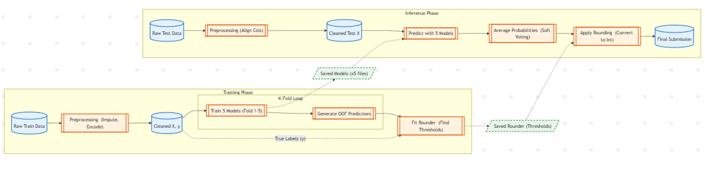
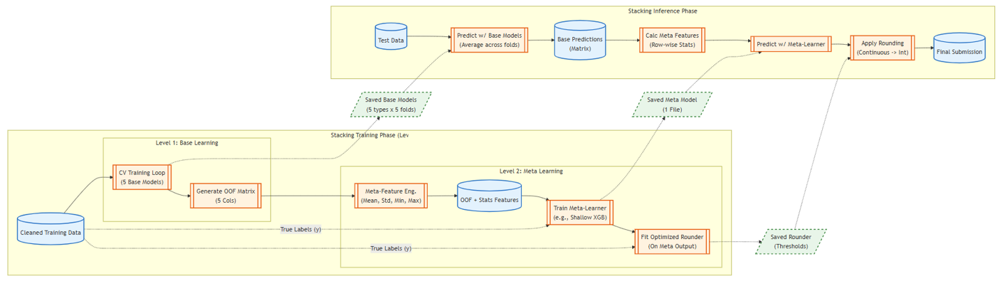
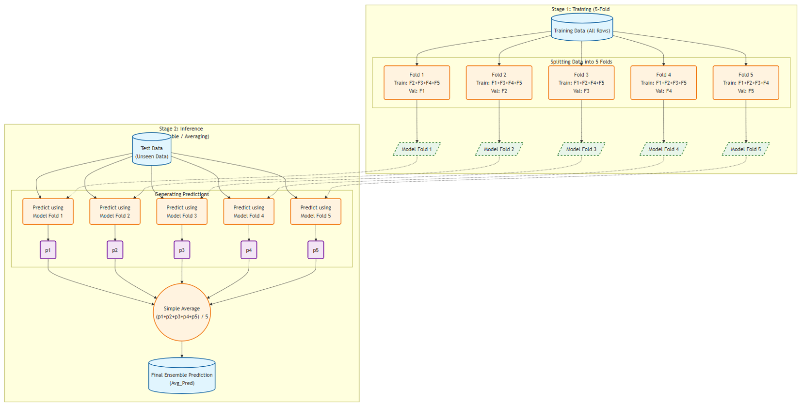

# Child Mind Institute - Problematic Internet Use

This project contains code for the [Child Mind Institute — Problematic Internet Use](https://www.kaggle.com/competitions/child-mind-institute-problematic-internet-use/overview) data mining competition. It involves analyzing data to predict problematic internet use based on physical activity and fitness data.

## Pipeline

Single Model:



Stacking Ensemble:


Using K-Fold Cross Validation Ensemble in training phase:



## Installation

### Prerequisites

- Python 3.12 or higher
- Conda (optional, for environment management)

### Setup

1. **Clone the repository:**
   ```bash
   git clone <repository_url>
   cd child-mind-institute-problematic-internet-use
   ```

2. **Download Data:**
   The `data/` directory is not included in the repository. Please download the dataset from Kaggle:
   
   [Child Mind Institute - Problematic Internet Use](https://www.kaggle.com/competitions/child-mind-institute-problematic-internet-use/data)
   
   Extract the contents and place them into the `data/` folder in the root of the project.

3. **Create and activate a virtual environment:**
   
   *Using `venv` (standard Python):*
   ```bash
   python -m venv venv
   source venv/bin/activate  # On Windows use: venv\Scripts\activate
   ```
   
   *Using `conda`:*
   ```bash
   conda create -n cmi_piu python=3.12
   conda activate cmi_piu
   ```

4. **Install dependencies:**
   ```bash
   pip install -r requirements.txt
   ```

## Usage

This project supports both **Training** (building models from scratch) and **Inference** (generating predictions on test data).

### 1. Training Pipeline

The training process is split into data preprocessing, Level 1 base model training, and Level 2 meta-learner training.

**Step 1: Preprocessing**
Clean and impute the training data.
```bash
python parsers/preprocess_data_imputed.py
```
- **Input:** `data/train.csv`
- **Output:** `data/train_cleaned_imputed.csv`

**Step 2: Train Level 1 Base Models**
Train a set of base models (e.g., XGBoost, LightGBM, CatBoost) on the processed data.
```bash
python models/train_level1_base.py --models XGBoost LightGBM CatBoost RandomForest HistGradientBoosting
```
- **Arguments:**
  - `-o, --output_dir`: Directory to save outputs (default: `outputs/regression_stacking_level1`).
  - `--models`: List of models to train (choices: `XGBoost`, `LightGBM`, `CatBoost`, `RandomForest`, `HistGradientBoosting`).
- **Outputs:**
  - Saved models (e.g., `XGBoost_fold1.pkl`)
  - `oof_predictions.csv`: Out-of-fold predictions for training the meta-learner.
  - `cv_scores.json`: Cross-validation scores.
  - **Visualizations:** Confusion matrices, feature importances, and learning curves in the output directory.

**Step 3: Train Level 2 Meta Learner**
Train a meta-learner using the OOF predictions from Level 1.
```bash
python models/train_level2_meta.py --meta-model XGBoost
```
- **Arguments:**
  - `-i, --input_dir`: Directory containing Level 1 outputs (must contain `oof_predictions.csv`).
  - `--meta-model`: The meta-learner architecture (default: `XGBoost`).
- **Outputs:**
  - `meta_model_XGBoost.pkl`: The trained meta-learner.
  - `meta_rounder_XGBoost.pkl`: Optimized thresholds for classification.

---

### 2. Inference Pipeline

The inference process involves preprocessing the test data and then generating predictions using either a single model or the full stacking ensemble.

**Step 1: Preprocess Test Data**
```bash
python parsers/preprocess_test_data.py
```
- **Input:** `data/test.csv`
- **Output:** `data/test_cleaned_imputed.csv`

**Step 2: Generate Predictions**

**Option A: Single Model Inference**
Generate predictions using one of the base models trained in Level 1.
```bash
python models/inference_single_model.py -m XGBoost
```
- **Arguments:**
  - `-m`: Model name (must match a trained model in the model directory).
  - `-d`: Model directory (default: `outputs/regression_stacking_level1` if that's where you trained).
- **Output:** A submission CSV containing:
  - `sii`: Final predicted class (0-3).
  - `sii_raw`: Raw regression prediction.
  - `sii_std`: Standard deviation across folds (uncertainty).
  - `sii_confidence`: Confidence score (distance to nearest class threshold).

**Option B: Stacking Ensemble Inference**
Generate predictions using the full stacked ensemble (Level 1 Models + Level 2 Meta-Learner).
```bash
python models/inference_stacking.py --meta-model XGBoost
```
- **Arguments:**
  - `--meta-model`: The meta-learner used in Level 2.
  - `-m`: Model directory containing all Level 1 and Level 2 models.
- **Output:** `submission_stacking_XGBoost.csv` (Final submission file).

### 3. Analysis & Utilities

#### Feature Engineering (`analysis/`)

**1. Generate Features from Time Series**
Extracts physiological features (L5, M10, RA) and behavioral features (Screen Obsession Index, etc.) from the granular series data.
```bash
python analysis/generate_features.py --data_dir data/series_train.parquet --output advanced_features.csv
```

**2. Clean Features**
Removes columns with high missing rates and imputes remaining missing values.
```bash
python analysis/clean_features.py --input advanced_features.csv --output advanced_features_cleaned.csv
```

**3. Merge Features**
Merges the engineered features into the main training dataset.
```bash
python analysis/merge_features.py --train data/train_cleaned_imputed.csv --features advanced_features_cleaned.csv --output data/train_final.csv
```

#### Visualization & Reporting (`analysis/`)

**1. Plot Features vs Target**
Generates scatter plots with regression lines to visualize the individual relationship between features and `sii`.
```bash
python analysis/visualize_features.py
```
*(Note: Edit the script to point to your merged dataset)*

**2. Plot Time Series**
Plots raw time-series data (enmo, anglez, light) for visual inspection of individual users.
```bash
python analysis/plot_time_series.py --limit 10
```

#### Data Utilities (`parsers/`)

- **Parquet to CSV Converter:**
  Converts the raw parquet partitions into CSV for easier inspection.
  ```bash
  python parsers/parquet_parser.py
  ```

- **Missing Value Analysis:**
  Checks missing values across all series files.
  ```bash
  python parsers/check_missing_series_values.py
  ```

- **Train Data Missing Value Check:**
  Inspects missing value distributions (row-wise and column-wise) in the training set.
  ```bash
  python parsers/check_missing_train_values.py
  ```


## Structure
- `data/`: Dataset files (train.csv, test.csv, parquet series).
- `models/`: Training and inference scripts (Level 1, Level 2, Stacking).
- `analysis/`: Feature engineering, feature merging, and visualization scripts.
- `parsers/`: Data preprocessing and utility scripts (Parquet conversion, missing value checks).
- `assets/`: Project assets and pipeline visualizations.

## Citation


```bibtex
@misc{child-mind-institute-problematic-internet-use,
    author = {Adam Santorelli and Arianna Zuanazzi and Michael Leyden and Logan Lawler and Maggie Devkin and Yuki Kotani and Gregory Kiar},
    title = {Child Mind Institute — Problematic Internet Use},
    year = {2024},
    howpublished = {\url{https://kaggle.com/competitions/child-mind-institute-problematic-internet-use}},
    note = {Kaggle}
}
```
